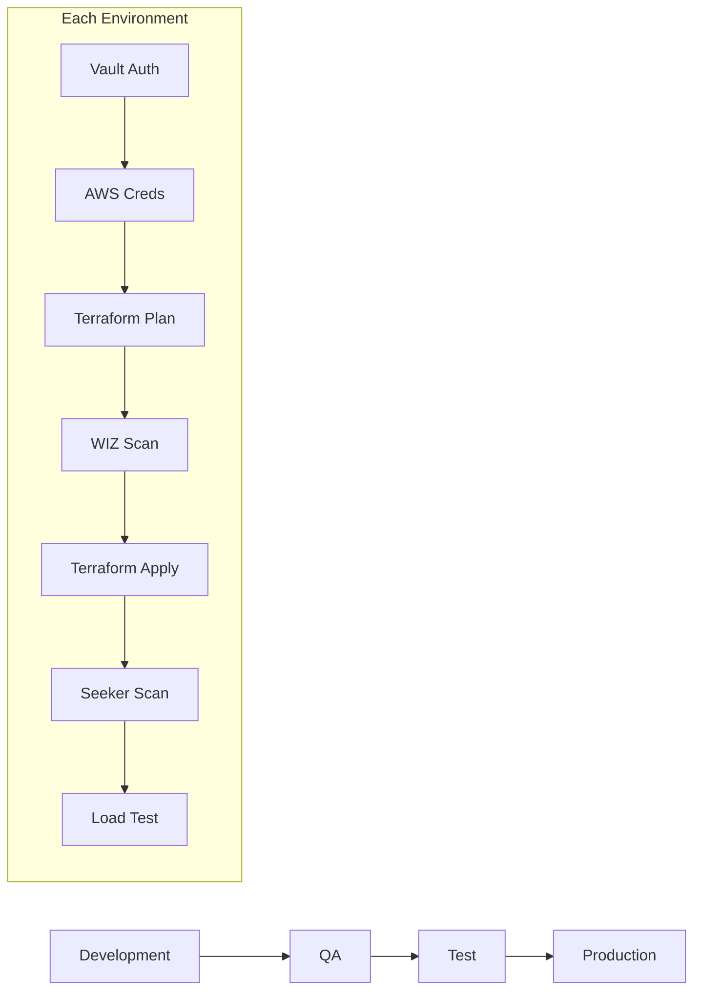

# 🚀 Harness Multi-Environment Pipeline Framework

A robust, template-based CI/CD pipeline framework for multi-environment deployments using Harness, with integrated security scanning, load testing, and automated approvals.

## 📚 Table of Contents

- [Features](#features)
- [Prerequisites](#prerequisites)
- [Getting Started](#getting-started)
- [Pipeline Structure](#pipeline-structure)
- [Configuration](#configuration)
- [Load Testing](#load-testing)
- [Security](#security)
- [Contributing](#contributing)
- [License](#license)

## ✨ Features

- 🔄 Multi-environment deployment pipeline (Dev → QA → Test → Prod)
- 🔒 Integrated security scanning with WIZ and Seeker
- ⚡ Automated performance testing with JMeter
- 🏗️ Infrastructure as Code using Terraform Cloud
- 🔐 Secure credential management with HashiCorp Vault
- ✅ Automated approval workflows
- 📊 Performance gates and metrics analysis

## 🛠️ Prerequisites

- Harness Account and API Key
- Terraform Cloud Account
- HashiCorp Vault Instance
- AWS Account (for infrastructure deployment)
- JMeter (for load testing)
- WIZ Account (for security scanning)
- Seeker Security Scanner

## 🚀 Getting Started

1. Clone this repository
2. Configure your environment variables
3. Set up required connectors in Harness
4. Update template variables as needed
5. Deploy your pipeline

For detailed setup instructions, see our [Setup Guide](docs/setup.md).

## 🏗️ Pipeline Structure

## ⚙️ Configuration

The pipeline uses a template-based approach for configuration:

| Variable | Description | Default |
|----------|-------------|---------|
| environment | Environment name | Required |
| workspace | Terraform workspace | Required |
| requireApproval | Enable approval gate | false |
| minApprovers | Minimum approvers needed | 1 |
| jmeterUsers | Load test concurrent users | 10 |
| jmeterRampUp | Load test ramp-up period | 60 |
| jmeterDuration | Load test duration | 300 |

For detailed configuration options, see our [Configuration Guide](docs/configuration.md).

## 📊 Load Testing

The pipeline includes comprehensive load testing capabilities:

- Automated JMeter test execution
- Configurable performance thresholds
- Performance gates for pipeline progression
- Detailed results analysis and reporting

Learn more in our [Load Testing Guide](docs/load-testing.md).

## 🔒 Security

Security features include:

- Infrastructure security scanning (WIZ)
- Application security testing (Seeker)
- Secure credential management (Vault)
- Environment-specific approvals
- Audit logging

For security details, see our [Security Documentation](docs/security.md).

## 🤝 Contributing

We welcome contributions! Please see our [Contributing Guidelines](docs/CONTRIBUTING.md) for details.

## 📝 License

This project is licensed under the MIT License - see the [LICENSE](LICENSE) file for details.

---

📫 **Need Help?** Check out our [documentation](docs/) or [create an issue](https://github.com/yourusername/harness-fission/issues).

